# 프로젝트 개발 보고서(Project Development Report)
-----------------------------------------------
## 0. 프로젝트 발표자료
웹페이지만들기.pdf / pptx 참조

### 0-1. 프로젝트 개발인원
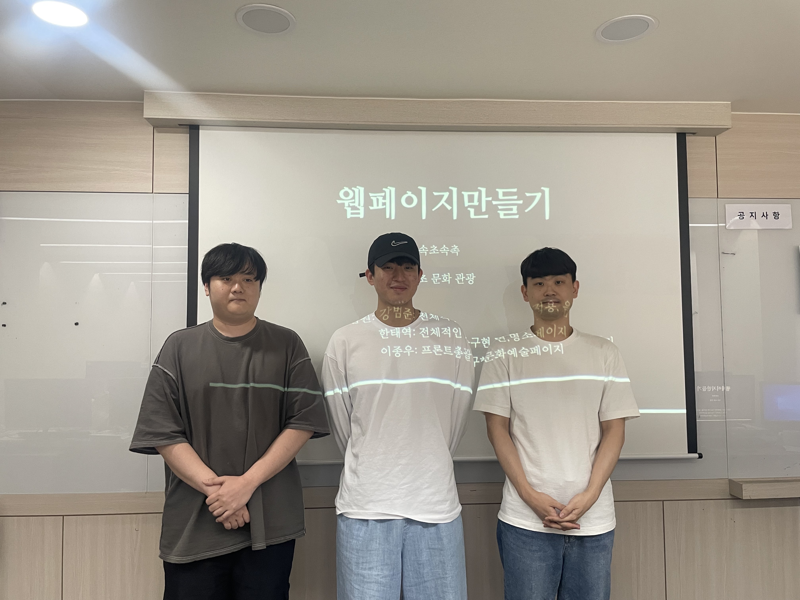

#### 0-2.1. 메인페이지 구현

#### 0-2.2. 사이트 소개 페이지
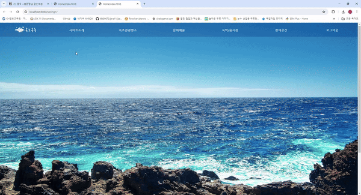

#### 0-2.2. 속초시 소개 페이지

#### 0-2.3. 개인정보처리방침 페이지

#### 0-2.4. 속초관광명소 페이지

#### 0-2.5. 속초축제 페이지

#### 0-2.6. 속초산림 페이지

#### 0-2.7. 속초해변 페이지

#### 0-2.8. 공연.예술 페이지

#### 0-2.9. 박물관 페이지

#### 0-2.10. 문화재 페이지

#### 0-2.11. 숙박/음식점 페이지

#### 0-2.12. 음식 페이지
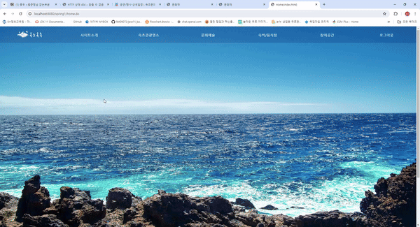
#### 0-2.13. 숙박 페이지
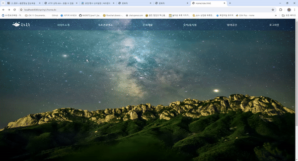
#### 0-2.14. 시장 페이지

#### 0-2.15. 공지사항 페이지
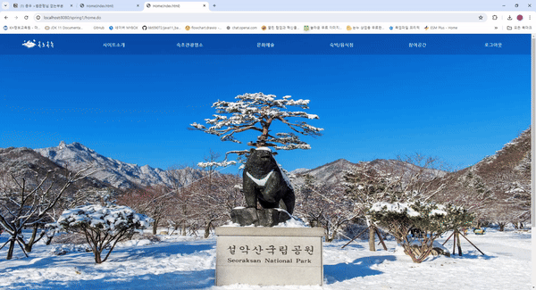
#### 0-2.16. 공지사항 추가 페이지
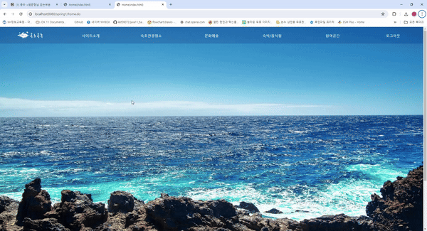
#### 0-2.17. 묻고 답하기 페이지
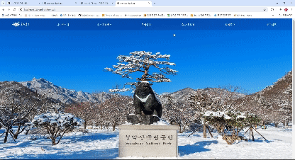
#### 0-2.18. 묻고 답하기 작성 페이지

#### 0-2.19. 답변 작성
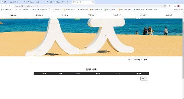
#### 0-2.20. 관리자 로그인 페이지
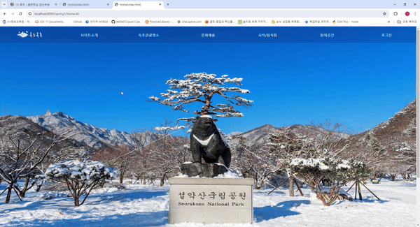
#### 0-2.21. 마이페이지 구현

## 1. 프로젝트 개요(Project Outline)

	산과 바다가 함께 위치하고있으며 많은 관광요소가 모여 있는 속초시를 소개하기 위한
	웹 애플리케이션을 자바 기반의 웹 애플리케이션으로 개발하게 되었다.

   

## 2. 프로젝트 목적(Project Purpose)

	사이트의 소개, 그리고 속초시에서 주관하는 문화/예술과 관련된 요소들과 
	속초시에 위치한 관광명소와 맛집 등을 소개하고, 커뮤니티를 이루며 
	정보를 공유할 목적으로 개발하게 되었다.

   

## 3. 프로젝트 개발 환경 정보(Project Dvelopement Environment)

 - Language Java 11
 - Develope Envirionment : Open JDK 11
 - Backend Framework : Spring Lagacy 5.3.20
 - Backend Library : Log4j + Lombok + MyBatis 
 - Frontend : HTML5 + CSS3 + Javascript ES5+ 
 - Frontend Library : jQuery
 - CSS Framework : Bootstrap 
 - Navigation Design : WordClod 3.7, Card Sort BoardMix
 - UI / UX Design 
 - Application Design : Object aid 1.2.4
 - Database Design 
   - Entity Relationship Design : MySQL Workbench 8.0 CE
   - Unified Modeling Language : draw.io 20.8.16
 - DataBase Management System : MariaDB 10.5
 - Web(Application) Server : Tomcat 9.0
 - Encrypt : Spring Security + Filter + Interceptor
 - Environment System : Window10 / 11
 - VCS(Version Control System) : github / Notion

   

## 4. 프로젝트 기획 및 설계(Project Planning & Design)

### 4-1. 네비게이션 설계(Navigation Design)

| 사이트소개 | 관광명소 | 문화예술 | 숙박/음식점 | 참여공간 | 로그인 |
|----------|----------|----------|----------|----------|----------|
| 사이트소개 | 축제 | 문화재 | 음식 | 공지사항 |
| 속초소개 | 산림 | 박물관/전시 | 숙박정보 | 묻고 답하기 |
| 개인정보처리방침 | 해변 | 이달의 공연 | 전통시장 | 자료실 |

 

#### 4-1.1. 자료 수집(Data Collection And Sort) - WordCloud

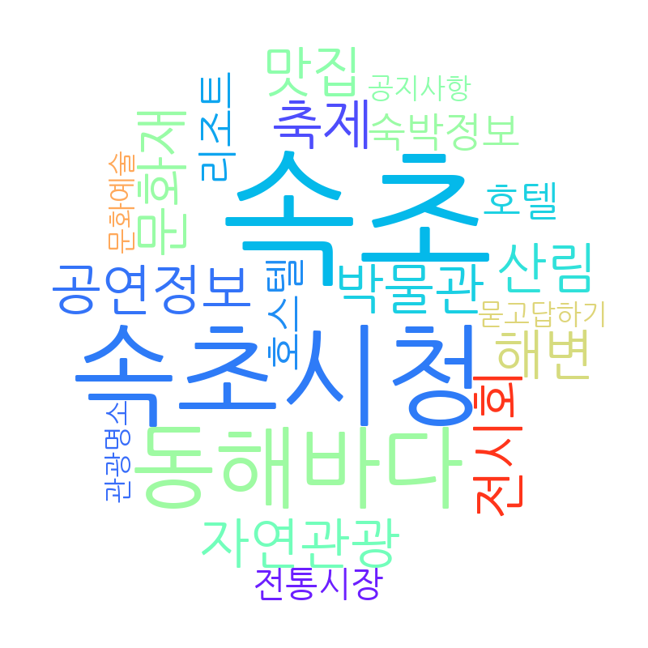

 

#### 4-1.2. 콘텐츠 분류(Content Cort) - Card Sorting

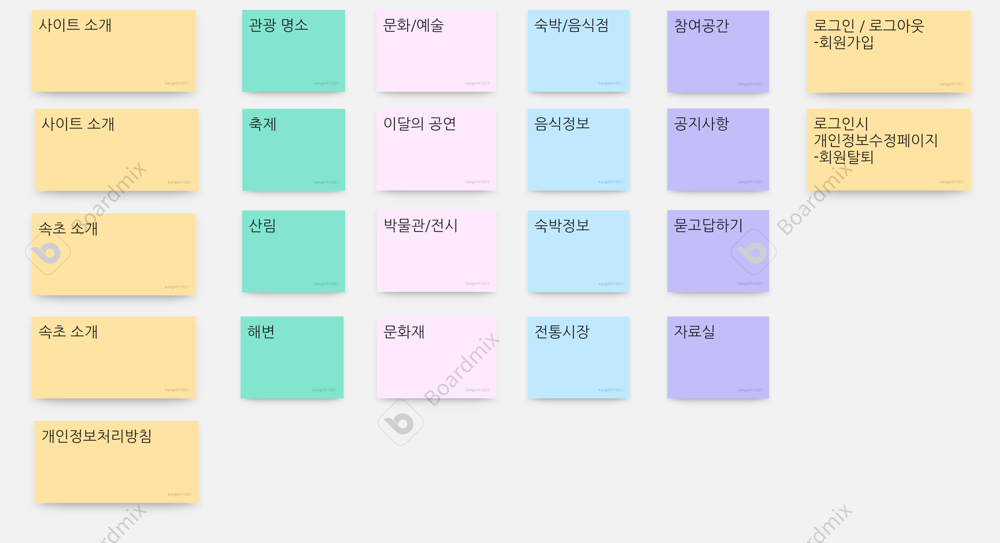

 

#### 4-1-3. 서비스 흐름 설계(Service Flow Design)

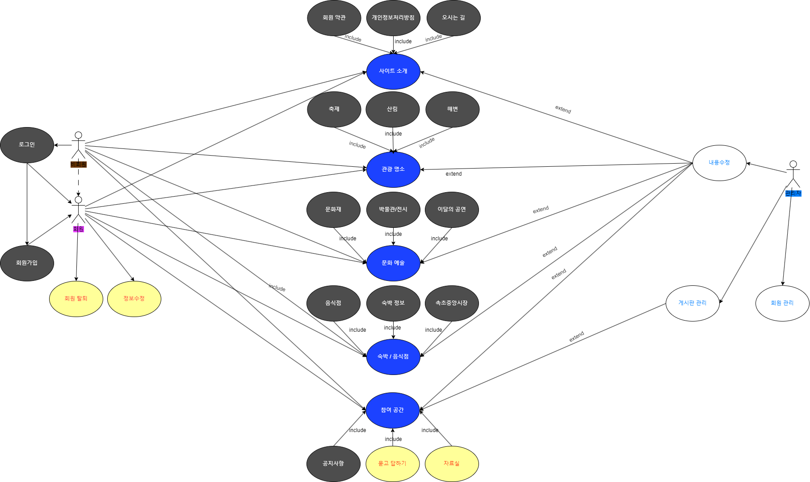

 

#### 4-1-4. 서비스 시나리오(Service User Scenario)

**회원/비회원 사용자 시나리오(Member User Scenario)**
1. 방문을 계획한다.
2. 해당 지역의 이벤트나 특이사항을 확인하기 위하여 공지사항의 글을 확인한다.
3. 공지사항의 글을 확인하거나 질문을 위하여 회원가입을 시작한다.
4. 회원가입을 시작하게 되면, 회원 약관 및 개인정보처리 방침에 동의하도록 한다.
5. 회원가입 페이지에서 필수 정보를 입력하고, 아이디의 중복확인 거쳐 회원 가입을 완료하도록 한다.
6. 회원 가입 후 로그인을 하도록 한다.
7. 공지사항 글을 확인하고, 해당 정보가 없는 경우 궁금한 사항을 질문하기 위해 묻고 답하기로 이동한다.
8. 묻고 답하기 페이지에서 궁금한 사항에 대한 답이 있는지 검색한다.
9. 해당 정보가 있으면, 해당 묻고 답하기 글을 확인하고, 없으면, 질문을 등록하도록 한다.
10. 카다로그나 가이드가 있는지 확인하기 위해 자료실을 탐색한다.
11. 해당 자료가 있음을 확인하고, 자료를 다운로드한다.

**관리자 시나리오(Administrator Scenario)**
1. 관리자로 로그인을 하도록 한다.
2. 공지사항 목록을 확인하고, 누락된 상세 정보가 있는지 확인한다.
3. 해당 지역의 이벤트나 특이사항을 공지사항으로 등록하도록 한다.
4. 변동된 내용이 있을 경우 공지사항을 수정하도록 한다.
5. 이벤트나 특이사항 중에서 취소된 내용이 있어 공지사항 글을 삭제하도록 한다.
6. 묻고 답하기 목록으로 이동하여 등록된 질문을 확인하여 답변 글을 등록한다.
7. 만약, 스팸 글인 경우나 불필요한 질문이 있는 경우 해당 글을 삭제하도록 한다.
8. 카다로그나 가이드가 새롭게 발생한 경우 자료실에 해당 글을 쓰고, 자료를 등록하도록 한다.
9. 회원목록으로 이동하여 신규 회원이나 탈퇴 회원을 확인하도록 하고,
현재 제적 사유에 해당하는 회원은 강퇴시키도록 한다.
-
### 4-2. 데이터베이스 설계

#### 4-2-1. 개념적 설계

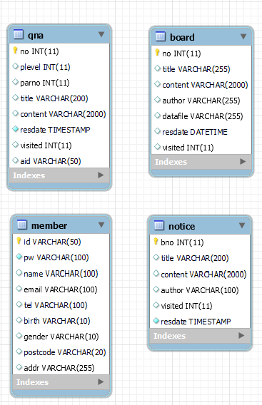

 

#### 4-2-2. 논리적 설계

 

#### 4-2-3. 물리적 설계

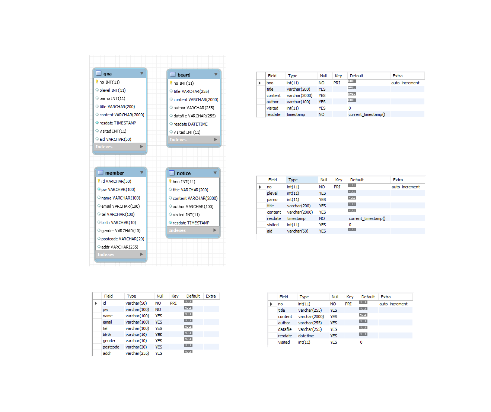

 

